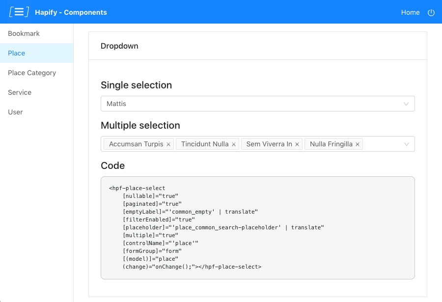
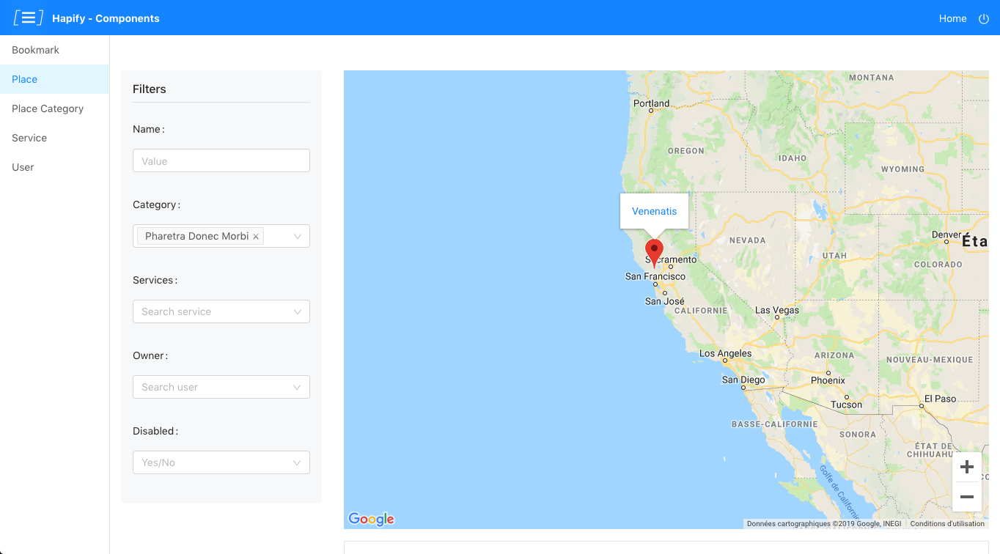

# Angular Components Boilerplate

This boilerplate provides a components library built with Angular 7.

> This boilerplate is meant to be used with Hapify. To get more info about Hapify setup, please refer to https://www.hapify.io/get-started.

## Preview

Some examples of what you will get:

### Selects & checkboxes for each model



### Dynamic map for geo-located models



## Get Started

### 1. Clone repository

-   **Option 1**: Clone and configure this boilerplate using command `hpf new --boilerplate ngx_components_tractr`.
-   **Option 2**: You can clone this repository and change the project id in file `hapify.json` by running command `hpf use`.

### 2. Generate code

Then you need to generate code from your Hapify project using `hpf generate`.

⚠️ **Important**: For development purpose, generated files are ignored in the `.gitignore`. You should edit this file and remove the last lines before committing.

### 3. API Dependency

This project depends on the [`hapijs_tractr`](https://github.com/Tractr/boilerplate-hapijs) API Boilerplate. Please install and start the API before running Angular Components.

Don't forget to create an user (https://github.com/Tractr/boilerplate-hapijs#31-installation). Otherwise, you won't be able to navigate.

### 4. Start project

Once the API is started, you can run the project:

```bash
npm install
```

```bash
npm start
```

## Models access

This boilerplate is meant to provide components for end users' front-end.
When you navigate in this boilerplate, you navigate as a non-admin user.

Therefore, if a model does not allow non-admin access to an action and you navigate to this action's view, it will result to an error.

_Example:_ You have a model `invoice`, its action `search` is restricted to the admins and you want to list the invoices.
It will throw an error because listing invoices for non-admins is not possible.

If you are looking for an admin dashboard, please refer to [`ngx_dashboard_tractr`](https://github.com/Tractr/boilerplate-ngx-dashboard).

## Advanced Integration

This boilerplate includes a user sessions management.
